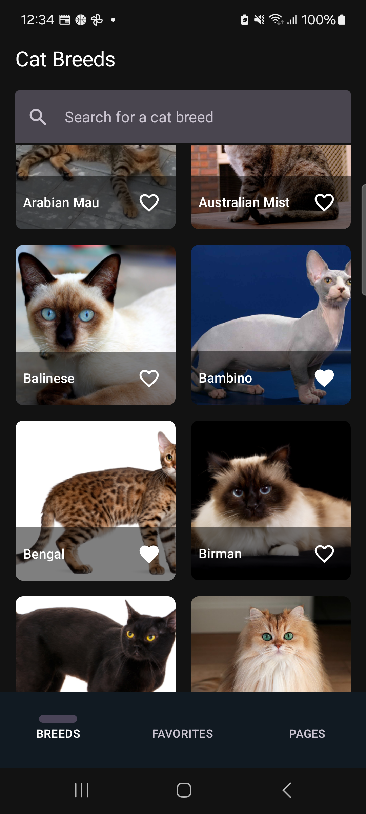
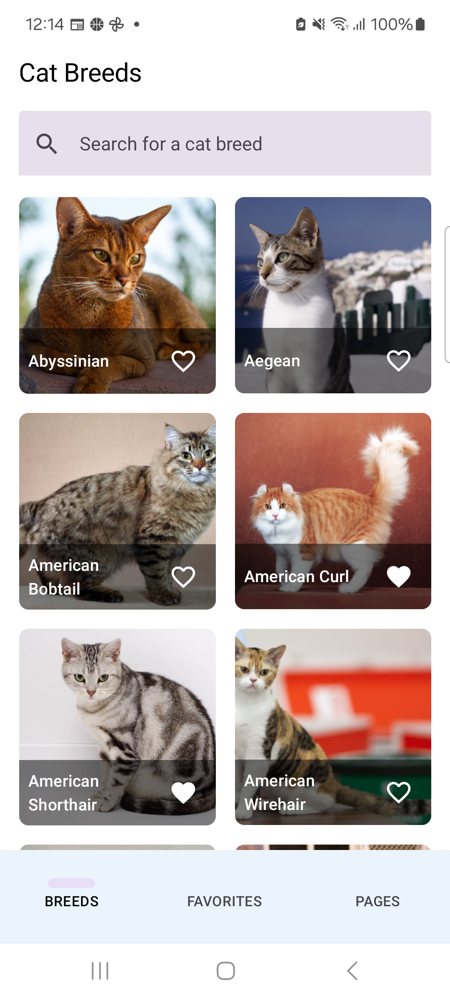
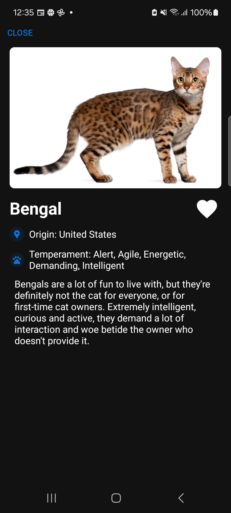
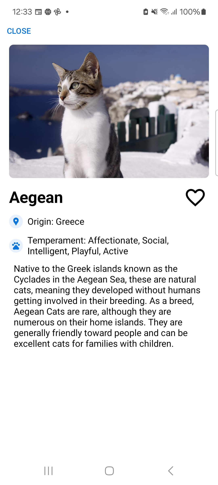
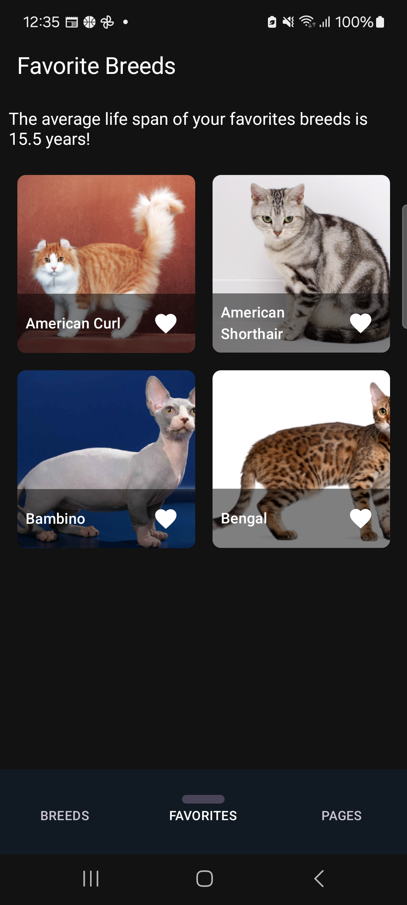
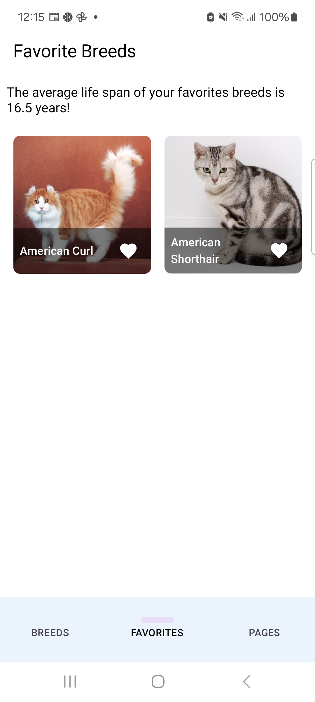
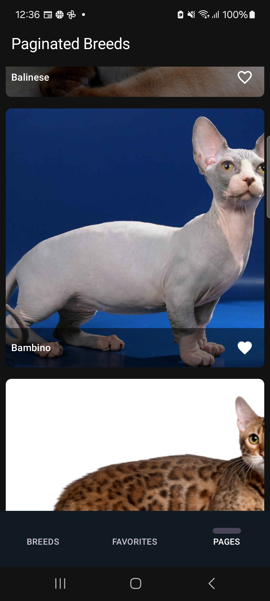
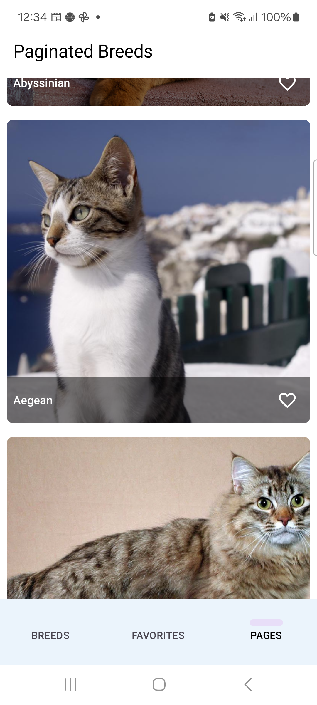

# Cat Breeds App

## Overview
Cat Breeds App is an Android application built using Kotlin that showcases a list of cat breeds using data from the Cat API.
Users can search for cat breeds, mark their favorite breeds, and view details about each breed.
It provides example implementations of offline support, pagination, unit and E2E tests.

## Features
- List of cat breeds with images and names;
- Search functionality to filter/search cat breeds by name;
- Mark cat breeds as favorites;
- View favorite breeds and average lifespan in a separate screen;
- Detailed view of each cat breed with additional information;
- Offline support with Room database (based on using database as single source of truth);
- Jetpack Compose for UI;
- Navigation Compose component to navigate between screens;
- Pagination for the list of cat breeds (PoC and left delay to test loading);
- Unit tests to validate logic;
- E2E tests to proper functionality between screens (PoC);
- Error handling (not very extensive);
- Light and dark mode supported (very simple set of colors used).

## Dependencies
- **Kotlin**: Version 1.9.10 used;
- **Java**: Version 17 used;
- **Jetpack Compose**: Used for UI;
- **Compose Navigation**: Used for UI navigation;
- **Material 3**: Used for UI components;
- **Hilt**: Used for dependency injection;
- **Retrofit**: Used for making API requests;
- **Room**: Database library for offline support and favorites management;
- **Paging3**: Used for pagination PoC;
- **Coil**: Used for image loading library;
- **Kotlinter**: Used to ensure proper syntax of the code.

## Architecture
This application follows the MVVM architecture pattern, utilizing Jetpack libraries for a clean and maintainable codebase.
Both storage and network implementations in the app are surrounded by a helper class to provide code abstraction, making the code easier to test and implementations easier to replace.
In terms of structure app is divided in :common, :core and :ui modules to provide separation of concerns.

## Testing
1. **Unit tests**:
    - Run unit tests using the following command:
    ```bash
    ./gradlew testDebugUnitTest
    ```

2. **E2E/Android tests**:
    - Run E2E tests using the following command, while a device/emulator is connected:
    ```bash
    ./gradlew app:connectedDebugAndroidTest
    ```

3. **Lint validation**:
    - Run lint validation using the following command:
    ```bash
    ./gradlew lintKotlin
    ```
    - If format is required run the following command:
    ```bash
    ./gradlew formatKotlin
    ```

## Result

**Breeds page:**

| Dark Theme | Light Theme |
|------------|-------------|
|  |  |

**Details page:**

| Dark Theme | Light Theme |
|------------|-------------|
|  |  |

**Favorites page:**

| Dark Theme | Light Theme |
|------------|-------------|
|  |  |

**Paginated Breeds page:**

| Dark Theme | Light Theme |
|------------|-------------|
|  |  |

## Additional notes
- **Database Handling**: The app uses an in-memory database for testing to avoid conflicts with the database;
- **API Key**: Author provided Cat API key for ease of use/test purpose but it is not the ideal solution. API key and API base URL are kept in a resources file to ensure that different environments are supported (i.e. Dev, Accept, Prod, etc);
- **Compose Preview**: An improvement for code development would be to add previews to all composable elements;
- **Modular Structure**: Module package are all missing by mistake the .catbreedsapp folder;
- **E2E Tests**: A decision to keep all dependencies imported in the :app module was made to avoid missing configurations that could lead to unavailability to run E2E/Android tests.